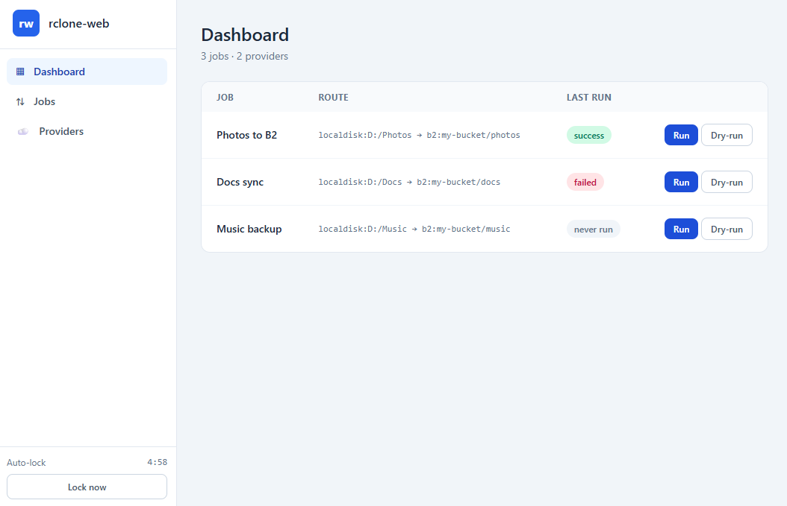

# rclone-web

A web frontend for [rclone](https://rclone.org/) that lets you manage and run rclone jobs from your browser. 
Job definitions and cloud-provider credentials are stored in a single [age](https://age-encryption.org/)-encrypted YAML file.

You can unlock with a password or a key file, and also run jobs/queues via the terminal if schedules are needed.



## Installation

**Homebrew (macOS/Linux)**
```bash
brew tap yetanotherchris/rclone-web https://github.com/yetanotherchris/rclone-web
brew install rclone-web
```

**Scoop (Windows)**
```powershell
scoop bucket add rclone-web https://github.com/yetanotherchris/rclone-web
scoop install rclone-web
```

rclone-web runs `rclone` as a subprocess, so make sure [rclone](https://rclone.org/downloads/) is installed and on your `PATH` (or point at it with `--rclone-path`).

## Examples usage

### Basic example

```bash
rclone-web init # creates an empty config YML file, asks for a password
rclone-web
```

### Custom init

```bash
# Generate a key file 'key.age', keep this safe. Don't bind on 0.0.0.0 either.
rclone-web generate-key 

# Initialise a config using a custom path and key
rclone-web init --config ./rclone-web.yml.age --key-file ./key.age

# Start the server
rclone-web --config ./rclone-web.yml.age --key-file ./key.age
```

### Running jobs/queues on the command line

You can run jobs and queues in the terminal, but it only works with a key file.

```bash
# Generate a key file 'key.age', keep this safe. Don't bind on 0.0.0.0 either.
rclone-web generate-key  

# Run a single job
rclone-web run --key-file ~/.config/rcloneweb/key.txt --job-id apple-orange

# Run a queue
rclone-web run --key-file ~/.config/rcloneweb/key.txt --queue-id noble-river
```

## Details

### Config file

rclone-web stores all its settings in an age-encrypted YAML config at `~/.config/rcloneweb/rcloneweb.yml.age` (override with `--config`). It holds your job definitions and provider credentials. It is **not** an rclone native config — credentials are passed to rclone as environment variables at run time. Every other setting is a command-line flag; there is no plaintext config file.

### Password storage

If you're not using a key file, rclone-web stores your full password or a fragment of it (if you chose to type only the first N characters to unlock) in the credential store:

- **Windows** — the OS Credential Manager.
- **macOS / Linux** — currently a fallback `chmod 600` file under `~/.config/rclone-web/creds/` (a native Keychain / libsecret backend is not yet implemented).

### Idle timeout

After a configurable period of inactivity (default 300s) the server locks and zeros the passphrase from memory.

### `run` flags

| Flag | Default | Description |
|------|---------|-------------|
| `--key-file` | *(required)* | Path to a file containing the passphrase |
| `--job-id` | *(none)* | ID of the job to run |
| `--queue-id` | *(none)* | ID of the queue to run |
| `--config` | `~/.config/rcloneweb/rcloneweb.yml.age` | Path to age-encrypted config |
| `--rclone-path` | `rclone` | Path to the rclone binary |

### Serve flags

| Flag | Default | Description |
|------|---------|-------------|
| `--config` | `~/.config/rcloneweb/rcloneweb.yml.age` | Path to age-encrypted config |
| `--port` | `8088` (random free port if in use; `0` = always random) | HTTP port |
| `--bind` | `127.0.0.1` | Bind address |
| `--idle-timeout` | `300` | Idle timeout in seconds (ignored with `--key-file`) |
| `--rclone-path` | `rclone` | Path to the rclone binary |
| `--key-file` | *(none)* | Path to a file containing the passphrase (enables key-file mode) |

## Building from Source

Requires Go 1.25+.

```bash
git clone https://github.com/yetanotherchris/rclone-web
cd rclone-web
go build -o rclone-web .
```

The browser UI is built from ES modules under `web/js/` (bundled by esbuild into `web/app.generated.js` via `go generate ./...`) plus Tailwind CSS (`web/app.css`). Both generated artifacts are committed, so a plain `go build` works without any front-end toolchain.

### Using Task

If you have [Task](https://taskfile.dev) installed:

| Command | Description |
|---|---|
| `task build` | Compile Tailwind CSS then build the binary |
| `task css` | Regenerate `web/app.css` only |
| `task dev` | Watch CSS and run the server on port 9090 |
| `task test` | Run `go test ./...` |
| `task release` | Cross-compile release binaries into `dist/` |
| `task install-tailwind` | Download the standalone Tailwind CLI into `.tools/` |

## Releases

Pushing a `vX.Y.Z` tag triggers the [Build and Release workflow](.github/workflows/build-release.yml), which cross-compiles binaries for Linux and macOS (amd64/arm64) and Windows (amd64), publishes a GitHub Release, and updates the Scoop manifest (`rclone-web.json`) and Homebrew formula (`Formula/rclone-web.rb`) in this repo.